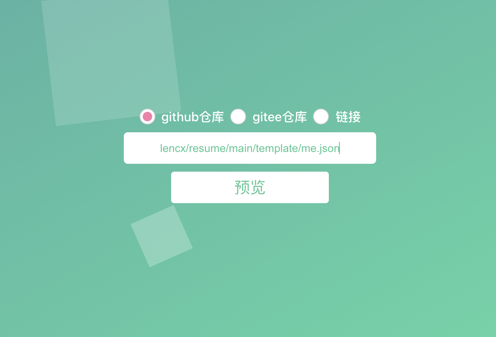

# 简历

> 简历模板，开发中...

## 制作简历

### Step1: 配置数据

1. 选择加载简历数据方式：目前支持`github仓库`，`gitee仓库`，和 `链接`
2. 在对应加载方式下添加简历的JSON文件，可以使用[此模板](./template/me.json)进行修改
3. 输入 `用户名/仓库/分支/路径/简历JSON文件` 例如 `lencx/resume/main/template/me.json`
4. 点击预览

### Step2: 预览简历

- 支持下载PDF
- 支持分享链接

[点击这里，查看效果](https://resume.nofwl.com/#/Z2l0aHVifGxlbmN4L3Jlc3VtZS9tYWluL3RlbXBsYXRlL21lLmpzb24=)

## TODO

- [x] 配置数据
- [x] 下载PDF
- [x] 分享简历
- [ ] 主题选择
- [ ] 在线编辑
